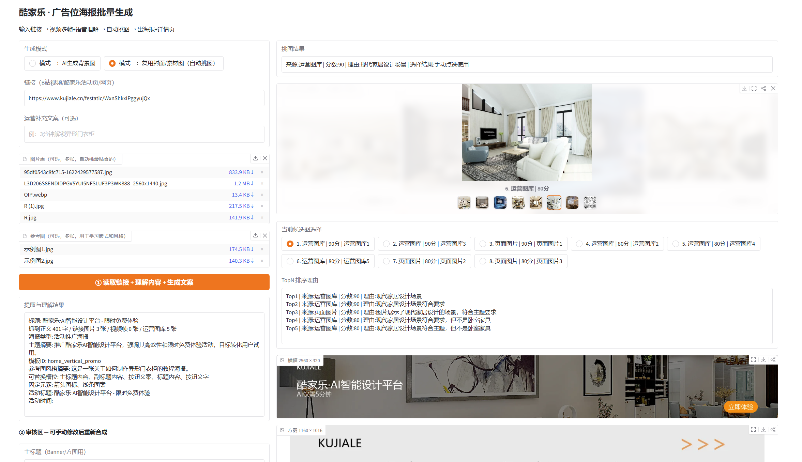

# 广告位海报批量生成工具

根据链接内容、视频画面、参考图风格和候选素材，自动生成广告位海报。

当前主界面输出两种规格：

- Banner：2560 x 320
- Square：1160 x 1016



## 当前能力概览

### 1. 链接理解（extractor.py + app.py）

- 支持直接粘贴 URL，也支持粘贴微信 / APP 分享文本，自动抽取真实链接
- 对 B 站链接走官方 API，提取标题、简介、封面和关键词
- 对普通网页 / 活动页抓取 OG 信息、完整正文和页面图片列表
- 自动提取活动页结构化字段：活动标题、副标题、福利、活动时间、CTA 文案
- `app.py` 会识别视频类链接（B 站、YouTube、腾讯视频、抖音等）并进入视频理解流程

说明：

- 结构化网页提取目前只对 B 站做了专门 API 适配
- 其他视频站点主要依赖通用网页抓取 + `yt-dlp` 下载理解

### 2. 视频理解（media.py）

- 使用 `yt-dlp` 下载视频或音频流，默认限制为 10 分钟 / 100 MB
- 自动尝试下载平台字幕，字幕优先于 ASR
- 用 OpenCV 均匀抽帧，默认 5 帧，并过滤纯黑 / 纯白空帧
- 无字幕时使用 `faster-whisper` 本地转写前 3 分钟内容
- 下载失败会自动降级为“封面图 + 元数据”方案，不阻断主流程

### 3. AI 文案与海报策划（ai_writer.py）

- 用视觉模型理解视频多帧内容，生成视频摘要
- 用视觉模型理解封面图，补充语义上下文
- 统一生成结构化 `poster_plan`
- `poster_plan` 包含：
  - `topic_summary`、`poster_type`、`audience`
  - `copywriting`：主标题 / 副标题 / CTA / 角标
  - `visual_strategy`：模板 ID、版式、配色、风格强度、蒙版强度等
  - `size_adaptations`：各尺寸提示词
  - `constraints`、`event_info`
- 自动把审核用提示词转换成“安全生图提示词”，剥离文字排版描述，减少出图乱码
- 提供兼容层，把新结构自动映射回旧字段（`title` / `subtitle` / `image_prompt` 等）

### 4. 参考图驱动设计（ai_writer.py + layout_analyzer.py + poster_maker.py）

- 支持上传多张参考图，先做 AI 风格分析，再做 OCR 布局提取
- AI 风格分析输出：
  - `template_id`
  - `layout_signature`
  - `banner_layout_mode` / `square_layout_mode`
  - `visual_language`
  - `color_palette`
  - `replaceable_slots` / `fixed_elements`
- PaddleOCR 提取参考图文字区域，生成结构化 `layout_specs`
- 自动从 Banner 参考图推导 Square / Detail 规格布局
- OCR 置信度低于 0.5 时，自动回退到固定模板系统
- 支持两种排版引擎：
  - 固定模板：按模板版式重新排版
  - 动态贴合：按参考图 OCR 坐标直接叠字

### 5. 候选图评分与自动挑图（app.py + ai_writer.py）

- 候选图来源包括：
  - 运营上传图库
  - 页面抓取图片
  - 封面图
  - 视频抽帧
- 视觉模型对候选图按主题做 0-100 分评分
- 返回 TopN 排序结果与简短理由
- UI 中可点击候选图，手动指定最终底图

### 6. 两种生成模式（app.py + image_gen.py）

#### 模式一：智能生成背景图（有图走图生图，无图走文生图）

适用场景：

- 希望基于某张图重绘出更统一的广告背景
- 没有底图时，直接根据提示词生成全新背景

实际流程：

- 有上传图：优先图生图
- 没有上传图但有候选图：默认取最高分候选图做图生图
- 没有任何候选图：直接文生图
- 图生图失败时回退文生图
- 文生图也失败时，若有原图则直接复用原图继续合成

补充说明：

- 文生图 / 图生图统一调用代理图片接口
- 支持异步任务轮询
- 兼容 OpenAI images/generations 风格响应
- 兼容 Gemini `inlineData` base64 图片响应
- 可将 OCR 提取出的文字安全区注入生图提示词，约束留白

#### 模式二：复用封面 / 素材图（自动挑图）

适用场景：

- 不一定重新生图，优先复用已有图片快速出海报
- 希望从页面图 / 图库 / 封面里自动挑一张最贴题的素材

实际流程：

- 优先使用手动上传背景图
- 否则从候选图中选择用户点选项或系统最高分项
- 若开启参考图驱动且上传了参考图，会额外尝试“参考图风格重绘”
- 若未上传参考图，则直接使用选中的素材进入排版

注意：

- 模式二不是“必须依赖参考图”的模式
- 参考图是可选增强项，不是必填项

### 7. 海报合成与动态排版（poster_maker.py）

输出规格：

| 规格 | 尺寸 | 说明 |
|------|------|------|
| Banner | 2560 x 320 | 顶部广告位 |
| Square | 1160 x 1016 | 信息流 / 模块位 |

核心能力：

- 支持三种版式语义：`left_text_right_visual` / `top_text_bottom_visual` / `centered`
- 支持 `reference_editorial` / `reference_bold` / `reference_showcase` 等模板风格
- 支持活动时间、角标、CTA 按钮渲染
- 支持参考图主题色驱动的文字色、按钮色、卡片色
- 支持全背景加蒙版，保证文字可读性
- 动态贴合模式下支持：
  - bbox 内自适应字号
  - 左 / 中 / 右对齐
  - 顶部安全边距
  - OCR 重复框去重
  - `title_zone_2` 自动映射为副标题区域

补充说明：

- 代码中还包含 `make_detail_page()` 详情页长图能力
- `poster_plan` 也会生成 `1080x1440` 尺寸提示词
- 但当前 Gradio 主界面尚未暴露详情页生成入口

### 8. 模板管理

- 可将当前 `poster_plan` 保存为命名模板
- 模板文件默认为运行目录下的 `poster_plan_templates.json`
- 加载模板后可恢复：
  - 文案
  - 各尺寸提示词
  - 活动字段
  - 参考风格信息

### 9. 风格对比测试

- 同一条内容 + 同一张底图，生成 A / B / C 三组对比结果
- 每组可上传不同参考图，直接比较模板、版式和视觉语言差异
- 会输出每组的参考图分析说明
- 若两组被识别为相同模板 / 版式组合，会给出冲突警告

### 10. 并发控制

- `demo.queue(default_concurrency_limit=1, max_size=16)`
- 用于限制并发请求，避免模型接口或 OCR 过载

## 快速开始

### 环境要求

```text
Python 3.10+
Windows（当前代码默认使用 Windows 字体路径）
```

### 安装依赖

```bash
pip install -r requirements.txt
```

当前依赖：

- requests
- beautifulsoup4
- pillow
- gradio
- openai
- python-dotenv
- yt-dlp
- opencv-python-headless
- faster-whisper
- paddlepaddle
- paddleocr

### 配置环境变量

新建 `.env`：

```env
ZHIPUAI_API_KEY=your_key_here
ZHIPUAI_BASE_URL=https://open.bigmodel.cn/api/paas/v4/
TEXT_MODEL=glm-4-flash-250414
VISION_MODEL=glm-4v-flash

# 图片代理接口
IMAGE_PROXY_BASE_URL=https://your-proxy/v1/images/generations
IMAGE_PROXY_API_KEY=your_proxy_key_here
IMAGE_PROXY_MODEL=nano-banana-pro
IMAGE_PROXY_IMG2IMG_URL=
IMAGE_PROXY_STATUS_URL_TEMPLATE=
IMAGE_PROXY_ASYNC=false
IMAGE_PROXY_POLL_INTERVAL=2
IMAGE_PROXY_POLL_TIMEOUT=180

# 语音转写
ASR_MODEL=tiny

```

说明：

- `IMAGE_PROXY_BASE_URL` 可直接填完整的 `/v1/images/generations` 地址
- 若只填到根路径，代码也会自动补全
- `IMAGE_PROXY_IMG2IMG_URL` 为空时，默认回退到 `/v1/chat/completions`
- `app.py` 启动时会先关闭 Paddle oneDNN：`FLAGS_use_mkldnn=0`

### 启动

```powershell
.\venv\Scripts\Activate.ps1
python app.py
```

浏览器会自动打开 Gradio 界面。

## 使用流程

### 主流程

1. 输入链接，支持网页、活动页、视频链接或分享文本
2. 可选填写运营补充文案
3. 可选上传：
   - 运营图库
   - 参考图
   - 手动指定背景图
4. 点击 `① 读取链接 + 理解内容 + 生成文案`
5. 在审核区检查并修改：
   - 主标题 / 副标题 / CTA
   - Banner / Square 审核用提示词
   - Banner / Square 安全生图提示词
   - `poster_plan` JSON
6. 选择生成模式与排版引擎
7. 点击 `③ 合成海报`

### 审核区可手改内容

- 主标题
- 副标题
- CTA
- `poster_plan` JSON
- Banner / Square 审核用提示词
- Banner / Square 安全生图提示词

### 风格对比页

1. 输入同一条链接
2. 上传统一底图
3. 分别上传 A / B / C 三组参考图
4. 点击生成，对比不同参考风格的实际效果

## 项目结构

```text
├── app.py                       # Gradio UI、状态管理、主流程编排
├── extractor.py                 # 链接提取：B站 API + 通用网页抓取
├── media.py                     # 视频下载、抽帧、字幕 / ASR 转写
├── ai_writer.py                 # 海报策划、文案生成、参考图分析、候选图评分
├── layout_analyzer.py           # OCR 布局提取与跨尺寸布局推导
├── image_gen.py                 # 文生图、图生图、异步轮询、代理响应兼容
├── poster_maker.py              # Banner / Square 合成、动态贴合、详情页长图
├── requirements.txt             # Python 依赖
├── README.md
├── image.png                    # README 截图
├── .env                         # 本地环境变量，不入库
└── poster_plan_templates.json   # 运行后按需生成的模板文件
```

## 备注

- 当前代码明显以 Windows 本地运行环境为主
- 字体路径默认读取 `C:/Windows/Fonts/...`
- 如果要迁移到 Linux / macOS，需要先调整字体加载与相关环境依赖
